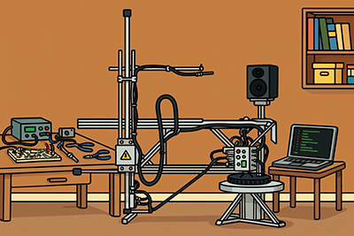

# Loudspeaker Acoustic Holography Scanner (LAH Scanner)

This project is a Python code pipeline to run a 3D loudspeaker measurement system.

The code is nearly complete and has been tested end-to-end with synthetic source data.  
However, my personal circumstances have changed so I do not have time to build the physical device.  
I provide this code with the hope that other audio hobbyists can complete the project.

> **Note:** I will not maintain this repository, but if you have questions I will try to reply during the first week.  
> Please feel free to fork it or re-use code — just give attribution.

---

## What It Does

The LAH Scanner project is designed to capture impulse responses (IRs) of a loudspeaker at many positions arranged on a cylindrical measurement point grid around the device under test.

These IRs are processed through **spherical harmonic expansion (SHE)**, which uses harmonic orders to describe the amplitude, phase, and direction of the sound field mathematically.

From this data, the sound field originating from the loudspeaker (internal to the measurement grid) can be separated from contributions from outside (room reflections and modes) to attain **anechoic data**.

This anechoic sound field can be **projected to any point in space** (outside the original grid), allowing the full 3D directivity, frequency response, and phase to be reconstructed at any desired distance or angle.

The scripts presented here make this possible.

---

## Code Overview

Below is a brief summary of each script and what it does.  
For detailed explanations and user settings, see the code comments.

The scripts are divided into two groups: **Capture** and **Process**.

---

### 🧭 Capture Scripts

#### `ir_gen_piston.py`
Generates synthetic impulse responses for points provided in a CSV file.  
Useful for testing when no hardware capture device is available.

#### `config_capture.py`
Contains user settings for the capture pipeline (grid size, sample rate, sweep range, IR gating, etc.).

#### `stage1_grid_gen.py`
Generates coordinates for a cylindrical measurement grid using Fibonacci spirals and radial jitter to avoid regular spacing anomalies.

#### `stage2_path_planner.py`
Orders coordinates for a robotic microphone arm (1 rotational + 2 linear axes) to minimize motion on the heavy rotational axis.

#### `stage3_run_capture.py`
Simulates robotic measurement drive (G-code over USB serial), plays/records frequency sweeps, and generates impulse responses.

#### `visualize_grid_util.py`
Plots coordinate CSV files for visualization.

#### `sweep_function.py`
Plays and records sweeps with a loopback timing reference.  
Reports available audio devices when run directly.

#### `make_ir_function.py`
Deconvolves recorded sweeps into system impulse responses.  
Can be run standalone or called by the capture pipeline.

---

### ⚙️ Process Scripts

#### `config_process.py`
Configuration file for all processing stages.  
Controls IR gating, LF/HF crossover, frequency range, solver settings, propagation angles, and output options.

#### `crossover_check.py`
Calculates a recommended LF/HF crossover frequency based on measurement geometry.

#### `stage1_preprocess_irs.py`
Windows IRs into LF (long gate) and HF (short gate) versions, applies filtering and normalization.

#### `stage2_she.py`
Performs spherical harmonic expansion (SHE) using adaptive harmonic order *N*.  
This is the main computational stage.

#### `stage3_extract_frd.py`
Performs **sound field separation** and evaluates the pressure field at chosen coordinates.  
Exports frequency responses (`.frd` files) and supports both arcs and arbitrary coordinate lists.

#### `stage4_make_ir_from_complex.py`
Converts complex pressure data from Stage 3 back into time-domain impulse responses for convolution or auralization.

---

## Dependencies

| Package | Description |
|----------|--------------|
| `numpy` | Core array and linear algebra functions |
| `scipy` | FFTs, filters, Bessel/Hankel functions, interpolation |
| `pandas` | CSV and table-style data manipulation |
| `soundfile` | Read/write WAV files |
| `matplotlib` | Plotting and 3D visualization |
| `h5py` | Read/write `.h5` coefficient data |
| `sounddevice` | ASIO/PortAudio interface for sweep capture |

---

## What Still Needs To Be Done

- **Build hardware** for taking impulse response measurements around the loudspeaker.
- **Create a robotic driver script** (G-code over USB serial).
- **Develop a simple GUI** so non–command-line users can operate the pipeline.  

See the file recommendations.md for suggestions to complete the project.

---

## License & Attribution

This project is open for educational and hobbyist use.  
If you use or modify this code, please credit the original author.

---

⭐ **Enjoy exploring loudspeaker acoustics and spatial sound-field analysis!**

