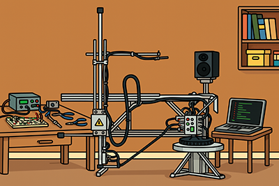
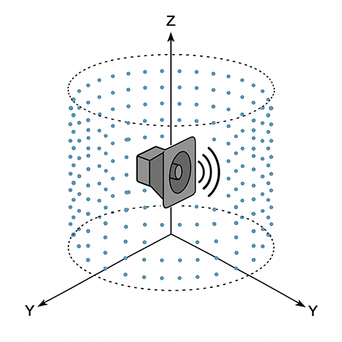
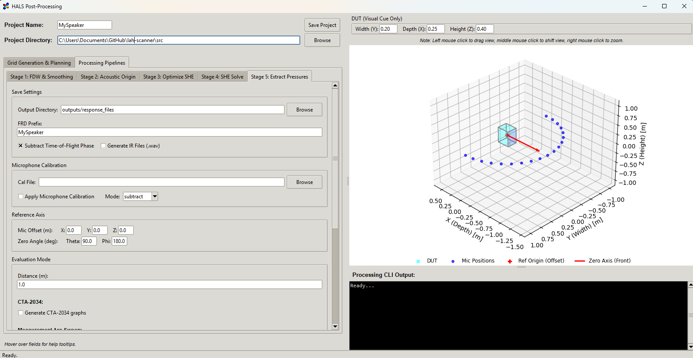
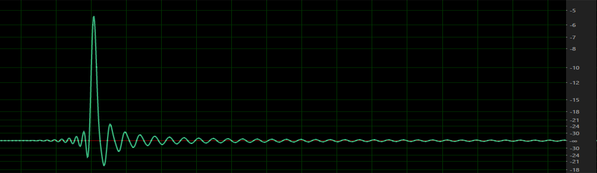

# Holographic Acoustic Loudspeaker Scanner (HALS) - Post-Processing Pipeline
*(Formerly Loudspeaker Acoustic Holography Scanner - LAH Scanner)*

This project is a Python code pipeline for the post-processing of 3D loudspeaker measurement data, representing the core processing component of the community project called **HALS**.

---



## What It Does

The HALS project is designed to process impulse responses (IRs) of a loudspeaker captured at many positions arranged on a cylindrical measurement grid around the device under test.

These IRs are processed through **spherical harmonic expansion (SHE)**, which uses harmonic orders to describe the amplitude, phase, and direction of the sound field mathematically.

From this data, the sound field originating from the loudspeaker (internal to the measurement grid) can be separated from contributions from outside (room reflections and modes) to attain **anechoic data**.

This anechoic sound field can be **projected to any point in space** (outside the original grid), allowing the full 3D directivity, frequency response, and phase to be reconstructed at any desired distance or angle (including full CTA-2034 "Spinorama" data).



---

## Graphical User Interface (GUI)

The entire pipeline can now be operated via a user-friendly Graphical User Interface (GUI). 
To launch the GUI, run:

```bash
python src/hals_gui.py
```

The GUI streamlines project management and grid generation as well as all processing steps to go from a directory of impulse responses to a full acoustic reconstruction while providing real-time execution tracking and graphical plots. The final stage allows detailed control over the export of frequency response and impulse response data from the reconstruction.

---

## Code Overview

The project is divided into two primary functional groups: **Grid Generation & Planning** and the **Processing Pipeline**. Detailed documentation for each stage can be found in the `documentation/` folder.

### 🎤 Grid Generation
- Generates coordinates for a cylindrical measurement grid using methods optimized to reduce regular spacing anomalies and Bessel nulls.
- Path planning algorithm orders coordinates for a robotic microphone arm to minimize motion on the heavy rotational axis and avoid travel through the cylinder internal volume.

### 💻 Processing Pipeline

The pipeline consists of 5 sequential stages:

#### Stage 1: FDW & Smoothing
Applies Frequency Dependent Windowing (FDW) to limit room reflections while preserving a consistent octave resolution, followed by complex domain smoothing to smooth HF comb filtering and reject chaotic reflection data based on the rate of phase slope.

#### Stage 2: Acoustic Origin
Automatically searches 3D space to locate the frequency-dependent acoustic origin of the loudspeaker. This prevents mathematical "ill-conditioning" by centering the solver on the true source of radiation.

#### Stage 3: Optimize SHE
Runs a lightweight optimizer to find the Harmonic Order N ceiling for your input data based on sound field separation performance, and tunes regularization (Lambda) settings based on data noise floor.

#### Stage 4: SHE Solve
The core computational engine. Performs the spherical harmonic expansion and sound field separation across the entire frequency range.

#### Stage 5: Extract Pressures
Evaluates the 3D sound field at your chosen coordinates (e.g., 1m on-axis, arc sweeps, CTA-2034 standards or custom lists). Exports FRD files (with optional Time-of-Flight phase subtraction) and impulse responses (WAVs) for use in simulation or auralization software.

---

## Dependencies

| Package | Description |
|----------|--------------|
| `numpy` | Core array and linear algebra functions |
| `scipy` | FFTs, filters, Bessel/Hankel functions, interpolation |
| `pandas` | CSV and table-style data manipulation |
| `soundfile` | Read/write WAV files |
| `matplotlib` | Plotting and 3D visualization |
| `h5py` | Read/write `.h5` coefficient data |

---
# Installation

1. Clone or copy the project to any directory on your system.  
2. Open a terminal in that directory.  
3. Run the following command to install all required dependencies:  
 
   ```bash
   pip install -r requirements.txt
   ```
   
4. Launch the GUI:
   ```bash
   python src/hals_gui.py
   ```

---

## License & Attribution

This project is open for educational and hobbyist use.  
If you use or modify this code, please credit the original author.

---

⭐ **Enjoy exploring loudspeaker acoustics and spatial sound-field analysis!**

***[ Dm17ri F4pp1n0v ]***


