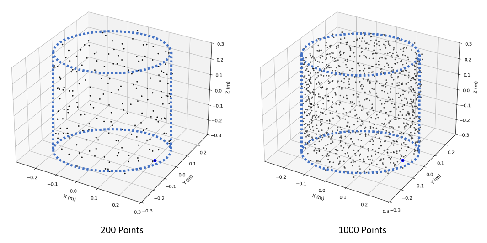

# Measurement Grid Generator

This script generates a CSV file containing the coordinates for every measurement point in the grid. Cylindrical coordinates are used at this stage (instead of spherical coordinates used by the math stages) because they align directly with the physical movement of the measurement hardware.

## CSV Column Definitions

| Column | Description |
| :--- | :--- |
| **r_xy_mm** | The radial distance in millimeters. **Note:** xy denotes the distance within the cylindrical plane, not a spherical straight-line distance from the origin. |
| **phi_deg** | The azimuth angle of the point in degrees. |
| **z_mm** | The vertical height of the point in millimeters. |
| **gen_settings** | A metadata column containing the exact configuration parameters used to generate this specific grid. |
| **order_idx** | Represents the sequence in which points should be measured. This is added by the subsequent script, `path_plan.py`, to ensure efficient mechanical motion and prevent hardware collisions. |

---

## Grid Dimensions and Clearances

* **Internal vs. External Bounds:** When configuring the grid, the specified `cyl_radius` and `cyl_height` represent the internal dimensions of the cylinder, allowing you to size the grid precisely around the physical dimensions of the DUT. You must ensure the internal dimensions clear any cables or accessories connected to the DUT. The absolute maximum external dimensions of the generated grid will be the specified height and radius plus the `wall_thickness_mm` (default 50mm). 

* **Point Density:** The `num_points` parameter dictates the total number of measurement locations. A value between 1000 and 2000 is generally a reasonable default for standard operations.

  

* **Keep-Out Zones:** The script includes parameters to define physical limits where the microphone cannot travel. The `phi_min_deg` and `phi_max_deg` parameters create an angular keep-out range, which is necessary if an endstop or mechanical limit prevents a full 360-degree rotation. Similarly, `bottom_cutoff_mm` creates a circular keep-out area at the centre of the bottom cap to avoid collisions with the DUT support pole.

  

---

## Constructing the Base Grid: The Fibonacci Spiral

The grid points are initially laid out as a cylindrical surface wrapped by a Fibonacci spiral.

* **Surface Area Equality:** The Fibonacci spiral is mathematically desirable because each point represents an equal surface area. This avoids the creation of discrete bands or tightly packed rings of points that can occur with simple grid divisions.

* **The Reverse Spiral:** To further distribute points uniformly, a second Fibonacci spiral is wrapped onto the cylinder in the opposite direction and rotated by 90 degrees. However, it is highly recommended to leave these at their default values.

* **Cap vs. Wall Allocation:** The script automatically calculates how many points belong on the end caps versus the side walls based on the ratio of the surface area they represent.

  

  

---

## Grid Requirements for Sound Field Separation

After the base cylinder is wrapped, the script assigns a "magnetic attraction" value to each point, pulling it outward to give the cylinder walls and caps a volumetric "thickness". The maximum distance of this outward expansion is defined by the `wall_thickness_mm` parameter.

### The Blind Spot Problem (Bessel Nulls)

If a measurement grid consists of only a single radius (a single layer), the SHE solver cannot track the behavior of the sound field as it travels through space, rendering field separation physically impossible.

While academic texts frequently depict a "dual-layer" approach, a grid with only two radii remains vulnerable. At certain characteristic frequencies, both layers may coincide with the zero-velocity nodes of the sound wave, causing the measurement system to lose its ability to resolve the acoustic field. In mathematical terms, this phenomenon is known as a **Bessel Null**.

To solve this "blindness," the grid generator distributes points across a continuous layer thickness (e.g., a default of 50mm) rather than locking them to discrete radii. Because points exist at highly varied distances from the source, if one specific radius falls into a null for a given wavelength, nearby points at different radii remain effective. This spreads the mathematical error spectrally and prevents severe accuracy drops at specific frequencies.

---

## Mathematical Stability: Grouping and Coupling

### The Grouping Problem

To ensure the blind spots of any pair of radial points are effectively counteracted by their neighbours, there must be no "grouping" of points with similar radii. Radial variation must be uniformly distributed across the entire grid to maintain a consistent "second opinion" for the solver.

### The Spatial Coupling Problem (Mode Leakage)

For the SHE matrix to solve correctly, it fundamentally assumes that the radial distance and the angle of every measurement point are entirely independent variables.

Any correlation between a point’s angle and its radius—even if it occurs randomly—causes spatial coupling. This leads directly to ill-conditioning and mathematical errors in the final solve. It is important to note that as soon as a grid utilizes more than a single radius, the angle and radius are technically no longer independent; therefore, the goal of the generator is to minimize correlation as much as possible.

---

## The Sine-Hash Solution

To guarantee that the radius and angle remain uncorrelated without causing points to "clump," the script utilizes a deterministic sine-hash.

1.  **Decoupling:** This hash assigns the radial pull value sequentially based on the point's order in the Fibonacci spiral and effectively severs any link between a point's spatial coordinate and its distance from the origin. Applying it based on the index (not the location) of the point in the Fibonacci spiral also helps to achieve uniform distribution.
2.  **Determinism vs. Randomization:** While pure randomization was tested, "unlucky" random correlations still occurred. Furthermore, the lack of determinism meant that generating the grid twice could produce two different performance outcomes. The sine-hash ensures high performance is repeatable.

---

## Advanced Settings

| Setting | Description |
| :--- | :--- |
| **Z-Axis Datum** | Controlled by `z_midpoint_zero`. When enabled, the origin is in the middle of the cylinder (positive and negative Z). When disabled, the datum is at the bottom (all Z values are positive). |
| **Reverse Spiral** | `generate_reverse_spiral`, `z_rotation_deg`, and `flip_poles` adjust the orientation of the secondary Fibonacci spiral. Developer defaults are recommended for optimal performance. |
| **Cap Fraction** | The `cap_fraction` parameter manually sets the ratio of points assigned to the top and bottom caps. It is recommended to leave this at `None` for automatic area-based calculation. |
| **Pull Strength** | `P_caps` and `P_side` dictate the mathematical strength of the hashed pull. Because side wall surface area increases as points are pulled outward (while cap area remains static), these are tuned differently to maintain constant volumetric density. |

**Note on $P_{side}$:** If you are using an exceptionally large measurement grid, the surface area of the side walls will increase more aggressively with radius. In these cases, $P_{side}$ may need adjustment to ensure the point cloud doesn't become too sparse.

The formula for the pull strength is:

$$dr = d_{max} \cdot (u_k^P)$$

**Where:**

* $dr$ = The Radial Displacement
* $d_{max}$ = The Maximum Thickness
* $u_k$ = The Sine-Hash Value
* $P$ = The Power Constant

### Point Quantization
To ensure human-readable filenames and data logs, radial and vertical coordinates are rounded to the nearest millimeter and angles to 0.1 degrees—a level of quantization that remains significantly smaller than the wavelength of 20KHz.