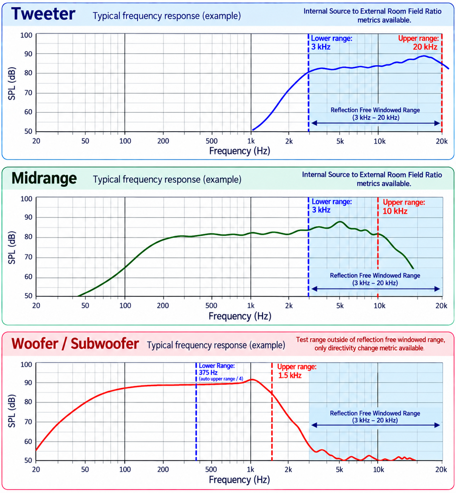
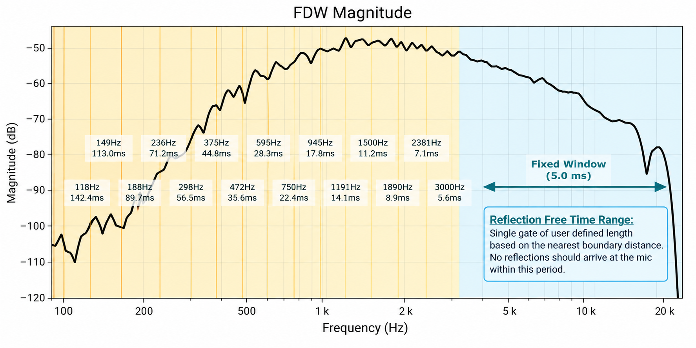
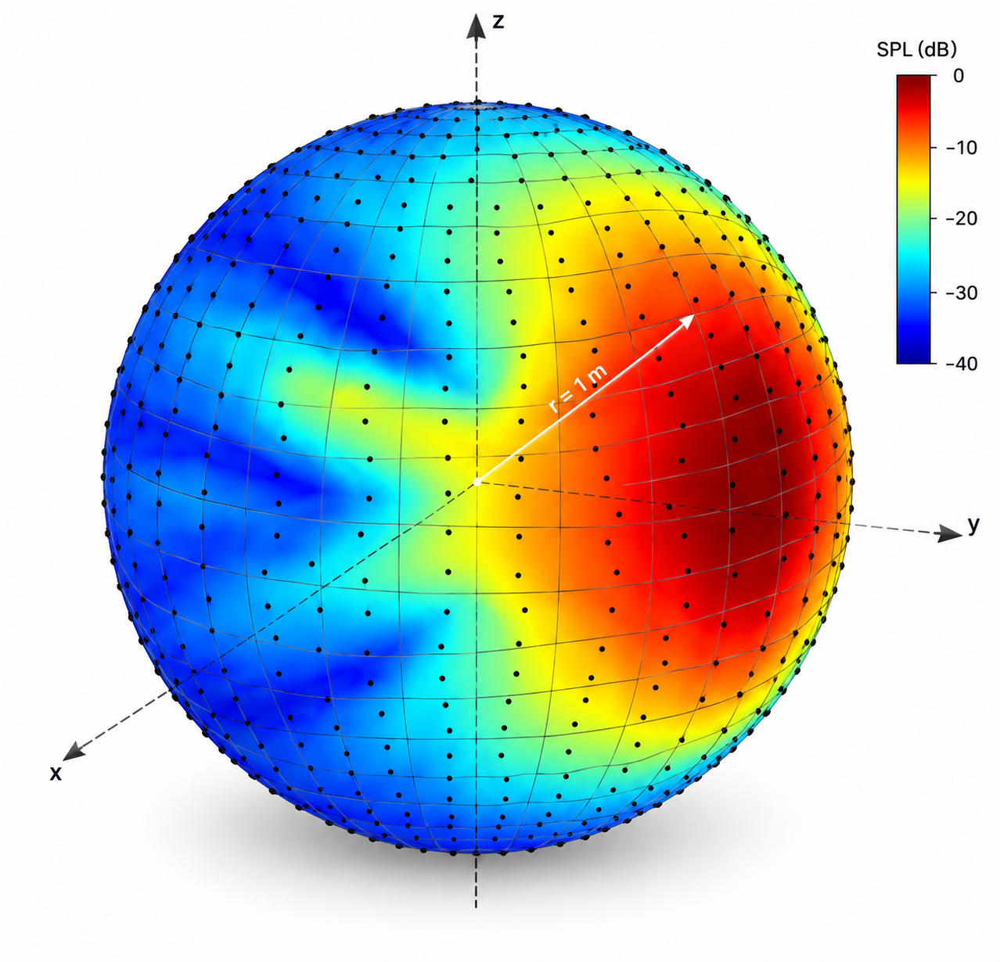
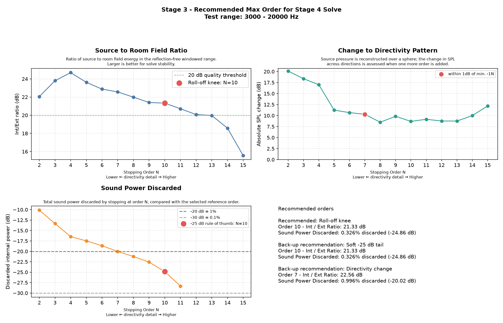
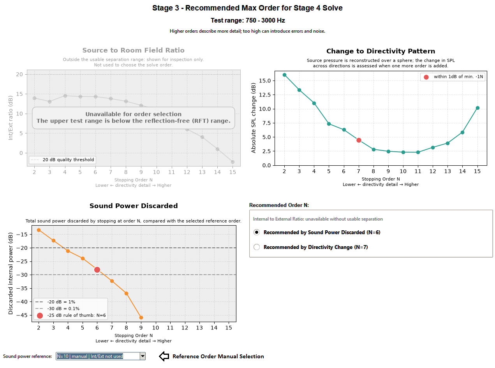
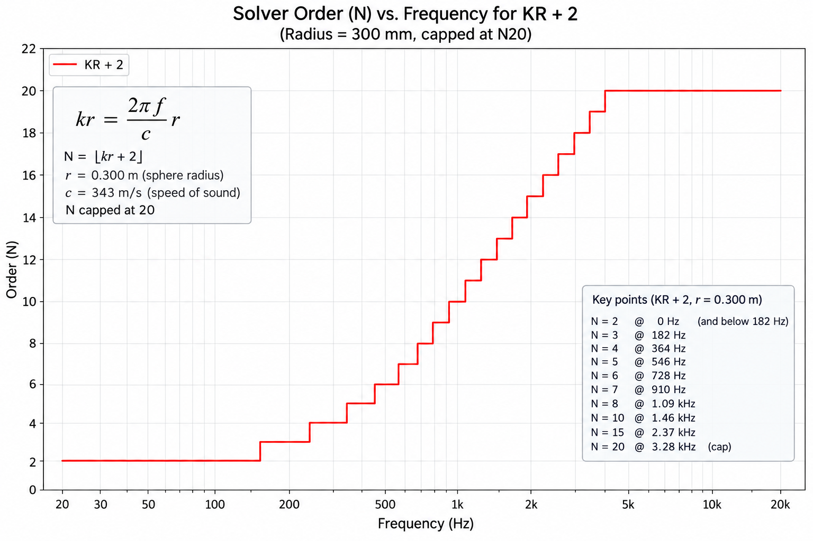

# Stage 3 Help - Recommended Maximum Order N

Stage 3 helps choose the maximum spherical-harmonic degree, usually called  
**order N**, used by the Stage 4 solve. In the app, this is the **Stage 3: Find**  
**Order N** tab.

This help file is split into two parts:

- **Usage Guide:** why Stage 3 is needed, what each setting does, and how to  
interpret the results.
- **Understanding the Optimization Process:** the selection rules and technical  
details behind the three diagnostics.

---

# Usage Guide

## What Stage 3 Does

Stage 3:

- solves the measured field across a range of maximum orders using a reduced  
set of frequencies;
- checks whether the internal source field remains well separated from the  
external room field;
- estimates how much internal sound power is omitted when stopping at each  
order;
- checks how much the reconstructed directivity changes when another order is  
added;
- recommends a maximum order for Stage 4; and
- saves one combined image of the results.

When processing finishes, the results window opens and lets you choose which  
proposed maximum order to use in Stage 4.

## Why We Do This

Spherical harmonics describe how the sound field changes with direction. A low  
maximum order produces a smoother model. Increasing the order allows the model  
to describe progressively finer directivity detail. This is angular resolution,  
not the frequency resolution familiar from FFT and frequency-response graphs.  
It controls how tightly spaced the features in the directivity pattern can be.

Higher orders are useful only while the input dataset contains enough independent  
spatial information to support it. If the order is set too high, the solve can  
begin describing measurement noise or errors as if they were real acoustic  
detail. This can create unrealistic features in the reconstructed sound field.

Stage 3 therefore looks for a practical balance:

- An order that does not exceed what the measurement data supports, keeping the  
internal and external fields well separated.
- An order that retains the majority of useful directivity information.
- An order that leaves little useful sound power in any omitted higher orders.

There is no single metric that proves an order is optimal. Stage 3 shows  
three complementary diagnostics and recommends an order based on each metric.

## Quick Start

For a normal first run:

1. Set **Upper Test Range** to the highest useful frequency of the driver before
  significant roll-off begins.
2. Leave the advanced settings at their defaults.
3. Click **Run Stage 3**.
4. Inspect the three graphs and the proposed orders, then click **Use in Stage
  4**.

The console shows the progress of the order sweep and field reconstruction.

## Main Settings

### Upper Test Range

Set this to the highest useful frequency of the driver or system under test,  
before its response rolls off significantly toward the noise floor.

Typical examples might be:

- full-range speaker or tweeter: up to 20 kHz;
- midrange driver: around 10 kHz; or
- woofer: around 2 kHz.

These are examples, not fixed limits. Use the measured response of the source.  
The upper end of the usable range is valuable for these tests because shorter  
wavelengths can contain the finest directivity detail and usually place the  
greatest demand on the spherical-harmonic order.



## Advanced Settings

Click **Show Advanced Settings** to reveal these controls.

### Lower Test Range

This is normally populated from the start of the reflection-free range derived  
from the Stage 1 time window. Frequencies in this range can be assessed using  
internal-to-external field separation because reflections have been removed by  
the time window.



Some sources, especially woofers, do not extend into the reflection-free range.  
**If the upper test limit is below the reflection-free-time boundary, Stage 3**  
**automatically sets the lower limit to one quarter of the upper limit.** This gives  
a two-octave test band. For example, an upper limit of 2 kHz gives a lower limit  
of 500 Hz.

This setting is normally left at its automatically populated value.

### Test Order Range

This sets the lowest and highest maximum orders to evaluate, for example  
`2, 15`.

The upper value should be high enough to show where useful improvement stops.  
Testing unnecessarily high orders increases processing time and cannot overcome  
the spatial limit of the measurement grid. Stage 3 also applies the grid and  
frequency-dependent order limits, so a requested order may be capped where the  
data cannot support it.

### Octave Resolution

This controls how densely Stage 3 samples frequency:

- `12` means 1/12-octave spacing;
- `24` means 1/24-octave spacing; and
- `0` tests every available frequency in the selected range.

All three diagnostics use the same frequencies. Finer sampling can  
reveal narrower frequency-dependent behaviour, but takes longer. The default  
1/12-octave spacing is a useful compromise for order selection.

### Directivity-change Sphere Points

Stage 3 reconstructs the modeled internal field over a sphere. This setting  
controls the number of points on that sphere.

More points make narrow directivity features less likely to be missed, at the  
cost of additional processing time. The default of 1,000 points is  
intended as a practical diagnostic resolution.



### Directivity-change Sphere Radius

This is the radius of the evaluation sphere used for the directivity-change  
comparison. The sphere is centred on the measurement coordinate origin and  
should enclose the source. The default is 1 metre.

The points are distributed by direction, so changing the radius does not change  
the angular sampling density. The pressure  
pattern can still evolve with distance, especially transisitoning from the near to far field.

## Reading The Results

The horizontal axis on each graph is the **stopping order N**. Moving to the  
right allows more directivity detail, but eventually increases the risk of  
errors in the results.



### Source to Room Field Ratio

This graph shows the ratio of modeled internal-field (source) energy to external-field (room)  
energy. It is the most direct metric for estimating how well the input data  
supports the maximum order of the solve.

In the reflection-free windowed range, the loudspeaker is expected to dominate  
the internal field while little energy should remain in the external  
room field because it has been removed by time windowing in Stage 1.

A larger ratio therefore indicates a more suitable and better  
separated solve. Stage 3 uses **greater than 20 dB** as a practical quality  
threshold.

The main feature to look for is the point where the curve begins a sustained  
post-peak decline. This is the **roll-off knee**. It suggests that increasing the  
order further is beginning to cost separation and robustness. This supplies an  
order candidate when the selected band can use reflection-free  
separation and a qualifying order exists.

The knee is a curve-shape heuristic. A smooth or unusual curve can make its  
location less obvious, so the other two diagnostics remain useful checks.

If the first detected knee is already at or below 20 dB, Stage 3 makes one  
second pass for an earlier, gentler steepening. It selects the latest such knee  
above 20 dB, confirmed by two consecutive declines before the rejected knee.  
This pass does not use the geometric bend fallback, which can mistake a  
flattening curve for the start of a steeper decline. Sensitivity is relaxed only  
once; if no candidate qualifies, the other recommendations remain available.

For this second pass, the slope increase must be at least 5% rather than 15%.  
The minimum additional decline is 0.02 dB per order or 0.15% of the full ratio  
span, whichever is larger. Both following segments must exceed the earlier  
median decline by at least a quarter of that minimum additional decline.

*Image placeholder: internal and external fields at increasing orders, showing*  
*the growth of unsupported external-field energy.*

### Sound Power Discarded

This graph answers: **How much modeled internal sound power would be discarded**  
**if the solve stopped at this order?**

The values are relative to the selected reference order. The true internal-field  
power is not known independently, so Stage 3 automatically uses the highest  
tested order with more than 20 dB internal-to-external separation. If no order  
exceeds that threshold, Sound Power Discarded is unavailable until you manually  
select a reference order.

More negative values mean less omitted power:

- −20 dB means 1% of the modeled internal power is discarded;
- −25 dB means 0.3%;
- −30 dB means 0.1%.

Stage 3 treats −25 dB as a rule of thumb. The first order reaching −24 dB or  
lower is offered as the sound-power recommendation. This 1 dB allowance reflects  
the fact that −25 dB is a soft target rather than a precise boundary.

This graph can provide confidence that the chosen stopping order captures most  
of the source sound power. It may also justify choosing a lower order than the  
other recommendations when little total power is gained by going higher.

Sound power is an average quantity. A small total contribution can still affect  
a narrow direction or frequency region, which is why the directivity-change  
graph is also provided.

### Change to Directivity Pattern

This graph asks: **How much does the source directivity change when one more**  
**maximum order is allowed?**

For each successive pair, such as N5 and N6, Stage 3 reconstructs both internal  
fields over the same sphere and compares their sound-pressure levels across all  
sampled directions and frequencies. The plotted curve is the 99th percentile  
of those absolute SPL changes, so isolated extreme values do not dominate it.

A falling curve means each additional order is changing less of the predicted  
field. A plateau or minimum suggests diminishing returns. A later sustained rise  
may indicate that increasing order is introducing error.

This diagnostic is especially useful when the source does not extend into the  
reflection-free range. In that case, genuine room energy may exist in the  
external field, so the internal-to-external ratio is not a fair selection  
metric. In practice, the directivity-change curve also tends to become smoother  
and easier to interpret across these lower-frequency bands. It therefore  
complements the field-ratio metric: Source to Room Field Ratio is strongest in  
the reflection-free range, while Directivity Change provides the primary order  
estimate when that range is unavailable.

## Recommended Orders

The results window shows a recommendation from each applicable metric. The  
selected radio button is the order sent to Stage 4.

When internal-to-external separation is usable:

**Stage 3 automatically selects the highest order suggested** by Source to Room  
Field Ratio, Sound Power Discarded, or Directivity Change. For example, if the  
three suggestions are N6, N8, and N7, the default recommendation is N8.  
You can still select any of the other eligible suggestions.

All offered choices must exceed 20 dB internal-to-external  
separation in this mode.

**When the upper range is below the reflection-free boundary, or no tested order**  
**exceeds 20 dB separation, Directivity Change becomes the**  
**selection method.**



---

# Understanding the Optimization Process

This section gives the precise rules and implementation details for users who  
want to understand how Stage 3 reaches its choices.

## Frequency Sampling And Order Caps

Octave-spaced targets are mapped to the nearest available frequency bins. Results are averaged with equal weight per sampled frequency.

The requested maximum order is limited by both the number of measurement-grid  
points and the frequency-dependent `kr` rule. The `kr` limit grows with  
frequency and grid radius, so it mostly affects the lower part of the frequency range.



## Source to Room Field Ratio Rule

At every tested order, Stage 3 calculates the mean internal-to-external energy  
ratio over the sampled frequencies.

The knee search starts at the peak ratio and examines the subsequent decline.  
It selects the first order where the decline becomes meaningfully steeper than  
the earlier post-peak trend and the following segment confirms that the change  
is sustained. If this test finds no knee, a normalized curve-distance method is  
used as a fallback. Weak or insufficiently developed curves may have no knee.

A knee is eligible only when its ratio is strictly greater than 20 dB.

More precisely, the primary knee test compares each post-peak decline with the  
median of the earlier positive declines. The new decline must be at least 15%  
steeper, must exceed the earlier trend by at least 0.08 dB per order (or 0.6% of  
the full ratio span when that is larger), and must be supported by the following  
segment. This rejects isolated one-order dips. The fallback identifies the  
strongest bend in the normalized post-peak curve and requires a minimum bend  
strength before it is accepted.

## Sound Power Discarded Rule

For a reference fit of order M, Stage 3 uses the outgoing internal coefficients  
to estimate the fraction of modeled internal power above each stopping order N:

```text
discarded(N, f) = power in degrees N+1 through M
                  --------------------------------
                  total internal power through M
```

Fractions are averaged across valid sampled frequencies in linear power units  
and then converted to dB. Common physical scale factors cancel within each  
frequency.

The reference M defaults to the highest tested order with mean separation  
strictly greater than 20 dB. The reference endpoint is zero by construction and  
is omitted. The active candidate is the first order below M whose discarded  
power is at or below −24 dB. This implements the displayed soft −25 dB target  
with a 1 dB allowance.

This is power represented inside the chosen reference model. It is not a  
measurement residual and cannot reveal information beyond the reference order.

## Directivity Change Rule

For every added order N, Stage 3 compares the independently fitted N−1 and N  
internal fields on the evaluation sphere.

At each sampled frequency, both pressure magnitudes are expressed relative to  
the spatial peak of the N−1 field. Values below −40 dB are clamped to that floor,  
so changes in very quiet regions do not dominate the diagnostic. Phase-only  
changes do not contribute.

Stage 3 pools the absolute local level changes from valid directions and  
frequencies and plots the 99th percentile. Fully capped comparisons are excluded  
from selection.

The selection rule is deliberately simple:

1. find the lowest valid value on the plotted curve;
2. find the earliest valid order within 1 dB of that minimum; and
3. recommend one valid tested order below it.

If there is no earlier valid order, the lowest valid tested order is used. This  
rule always returns a candidate when valid directivity comparisons exist.

When separation is usable, the directivity candidate is offered only if its  
internal-to-external ratio is greater than 20 dB. When separation is not usable,  
the directivity rule selects the order directly.

## What Stage 3 Saves

Stage 3 saves one combined results image containing the three graphs and the  
recommendations. The results window reports the output directory.

The selected recommendation is not applied until **Use in Stage 4** is pressed.

---
